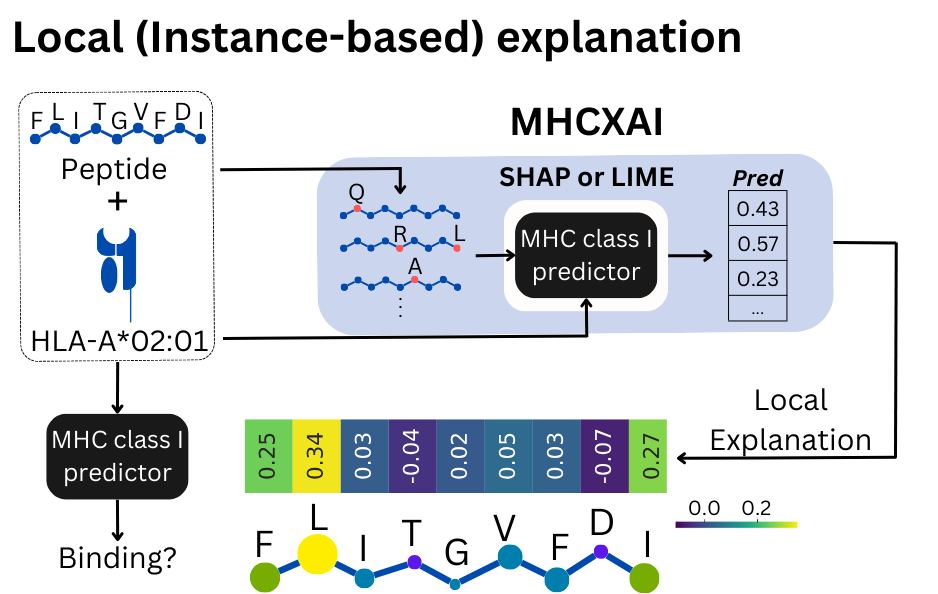

# MHCXAI
Framework for generating SHAP and LIME explanations for MHC class I predictors

<p align="center"></p>

MHC class I predictors supported:
1. MHCflurry (https://doi.org/10.1016/j.cels.2020.06.010)
2. NetMHCpan (https://doi.org/10.1093/nar/gkaa379)
3. MHCfovea (https://doi.org/10.1038/s42003-021-02716-8)
4. TransPHLA (https://doi.org/10.1038/s42256-022-00459-7)

# Notebooks
**0 - Benchmark**

**1 - MHCXAI usage and instance based explanations**

**2 - Model Validation with BAlaS**

**3 - Consistency**

**4 - Stability**

**5 - Explanation for alleles - TransPHLA**

# To add new predictor


Citation:
```bibtex
```

